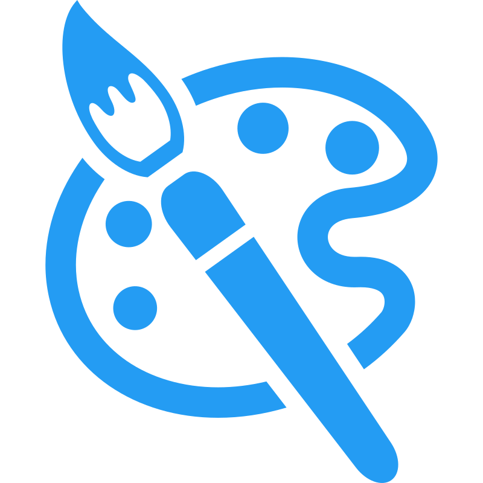

#  Palette Hub

Palette Hub is a social media site for sharing palettes of hex code colors. Users can create, browse, and share palettes, as well as engage with them through “likes”. Palette Hub does not store user credentials on the site but instead uses Google’s third-party authentication service “Sign In with Google for Web.” Becoming a user — which unlocks all of the site’s available features — is simple and only requires a Google account to sign up.

The purpose of Palette Hub is to showcase a full stack website including Database Management, Backend REST API, Frontend Website, and Container Orchestration. I diversified the stack to exhibit a wide range of skills. The stack includes a MySQL Database, Spring Boot REST API, Create-react-app website, Nginx web server, and Docker Compose container orchestration.


## Scripts

### Starting Dev Environment

To start the development environment use the following commands:

#### Windows

```cmd
scripts\start_dev.cmd
```

#### Linux

```sh
scripts/start_dev.sh
```

### Starting Prod Enviroment

To start the production environment use the following commands:

#### Windows

```cmd
scripts\start_prod.cmd
```

#### Linux

```sh
scripts/start_prod.sh
```

## Docker 

### Container Orchestration

This project uses [Docker Compose](https://docs.docker.com/compose/) for container orchestration. In later versions it will migrate to [Kubernetes](https://kubernetes.io/) for production to improving scaling the services.

The configuration for the containers can be found in the docker compose and env files:

- `docker-compose.yaml`
- `docker-compose.dev.yaml` *(Only on dev env)*
- `docker-compose.prod.yaml` *(Only on prod env)*
- `.env` *(environment variables)*

The environment uses three containers:

- MySQL
- Spring Boot REST API
- Nginx web server that serves Create-react-app and reverse proxy traffic to the REST API.

### Secrets

In development mode the docker compose is setup to use the secrets found in the `/secrets` folder. In production mode the secrets need to be setup externally using the [docker secret create](https://docs.docker.com/engine/reference/commandline/secret_create/) command:

```sh
printf "This is my super secret secret" | docker secret create my_secret -
```

These are the secrets that need to be set:

- db_api_pass
- jwt_secret
- db_root_pass

## Client

The client directory contains all the client code. Currently this project only has a website. In later versions an admin website will be introduced as well as a mobile app.

### Nginx

All traffic goes through the Nginx web server. HTTP traffic is redirected to HTTPS traffic. The subdomain `api` is setup as a reverse proxy to the Spring Boot REST API.

### React app

The website was made using [Create-react-app](https://create-react-app.dev/) along with [React Bootstrap](https://react-bootstrap.netlify.app/) using [Bootstrap 5](https://getbootstrap.com/) for UI design. For more information checkout `/client/web`.

## REST API

The REST API uses the [Java Spring Boot Framework](https://spring.io/projects/spring-boot) using [Maven](https://maven.apache.org/) for dependency control. Unit tests are setup with [Testcontainers](https://testcontainers.com/). For more information checkout  `/rest_api`.

## MySQL

This project uses a [MySQL](https://www.mysql.com/) Database. The schemas and Stored Procedures were designed using [MySQL Workbench](https://www.mysql.com/products/workbench/). A user is created for the REST API to access the Database. This user is limited to only calling  sprocs for security concerns incase the api is compromised. For more information checkout `/msysql`.